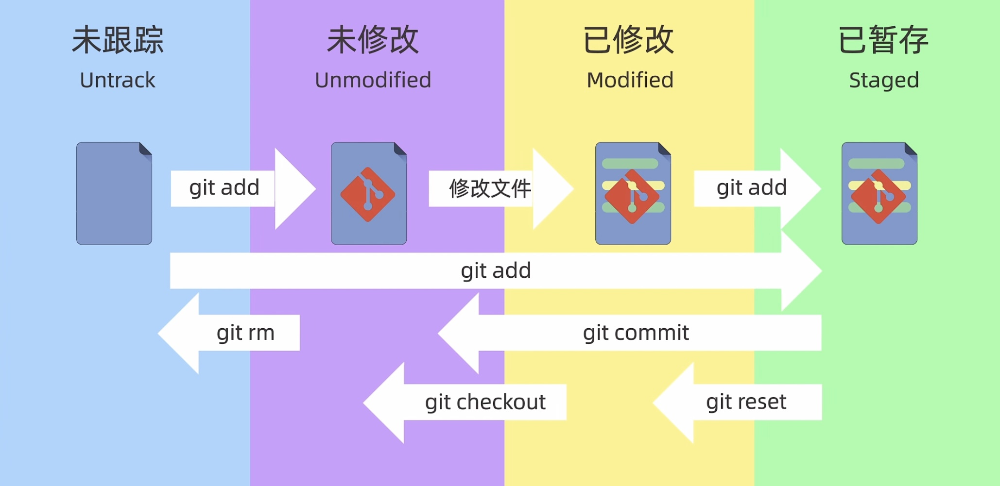
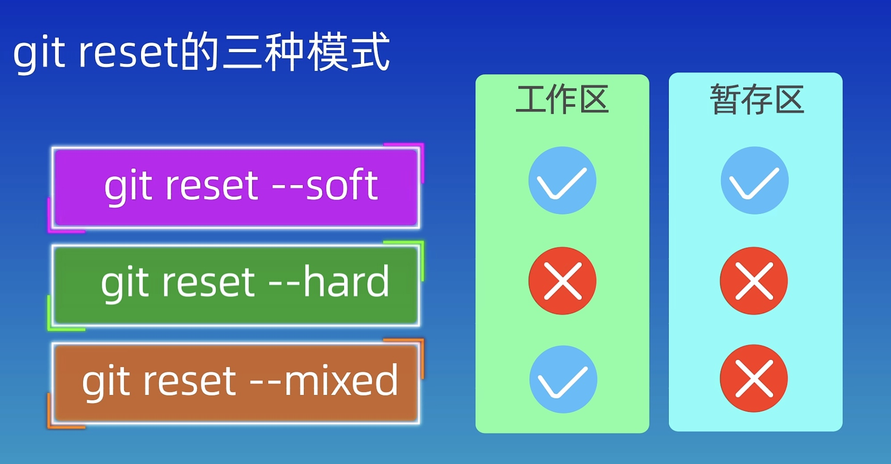

# Github guide

## Intro
#### Git的四个区域
- 工作区：电脑里的本地文件夹
- 暂存区：临时缓冲区，提交时是将暂存区的文件提交到本地仓库的
- 本地仓库：git的版本库，每提交一次就在此处有一个版本
- 远程仓库：托管到远程github的仓库

#### Git的三种状态
只有已提交才会创建一次snapshot
所有的文件夹和文件都包括三种状态:  
- 已修改 
- 已暂存 
- 已提交
通过git status来查看本地仓库的状态


## 账户配置
#### 账户设置
首先对账户进行配置
```bash
git config --global user.email "`your_email`"
git config --global user.name "`your_username`"
```
#### 生成密钥
ssh-keygen -t rsa -C ''账户名''
将.ssh下生成文件对应的公钥文件，后缀为.pub的内容复制到github->setting->SSH and GPG keys->new SSH key

## 仓库建立
#### 从0开始建立
首先需要创建一个文件夹，在文件夹中使用
```bash
git init
```

#### clone已有仓库
```bash
git clone url_repo
git clone url_repo `myrepo`
```
`myrepo`为仓库文件夹名，里面包含clone下来仓库的所有信息

## 添加和提交

#### 添加
添加文件到暂存区
```
git add <file>
```
添加所有文件到暂存区
```
git add .
```

git rm 将文件从暂存区中删除

- 将`filename`从暂存区和本地同时删除
```bash
git rm -f `filename`
```
- 将`filename`从暂存区删除，但文件保存在本地
```
git rm --cached `filename`
```

#### 提交
git commit 将暂存区的文件提交并创建一次snapshot
需要添加提交信息`message` 
```bash
git commit -m `message` 
```
只有已提交才会创建一次snapshot，且会有head指针指向该次snapshot；每个快照都有一串hash值 
可以通过git checkout返回某一次快照  **慎用**

git commit --amend 修补提交，会以第二次提交结果替代第一次提交，防止因漏掉文件导致提交记录杂乱。
```bash
git commit -m `message`
git add forgotten_file
git commit --amend
```

git log 查看快照历史
```bash
git log ––all ––graph ––decorate
git log ––all ––graph ––decorate ––oneline
```

#### 返回某一个版本
git reset有三种模式，软模式、硬模式、混合模式
```bash
git reset --soft <hash_value>
git reset --hard <hash_value>
git reset --mixed <hash_value>
```


## 远程仓库
#### 添加远程仓库
git remote add `shortname` `url`
添加一个新的远程 Git 仓库，同时指定一个方便使用的简写
```bash
#urlA is your remote repo url in github
git remote origin urlA
```

#### 远程提交过程


#添加远程仓库
```
git remote add origin `repo_url`
#在特殊情况下重命名尚未存在的当前分支名称，例如处于一个新的空存储库中时
git branch -M main
```

>git push <name> <local branch>:<remote branch>
推送本地的local branch分支，并将其作为远程仓库name的remote branch分支
git push origin main:main 
将repo的本地副本复制到远程

推送到远程仓库origin的master分支
```
git push -u origin HEAD:master
```
#### 克隆远程仓库
git clone `remote_repo_url` `local_folder_name`
将`remote_repo_url`下的远程仓库克隆到本地`local_folder_name`中
若远程仓库后续存在更新，本地仓库并不会检测到
git clone ––shallow
只会获取最新的snapshot而不会有版本记录

#### 拉取远程仓库
git fetch `remote`
这个命令会访问远程仓库，从中拉取所有你还没有的数据。
必须注意 git fetch 命令只会将数据下载到你的本地仓库——它并不会自动合并或修改你当前的工作
**如果设置了跟踪远程分支，git pull 会自动抓取后并合并远程分支到当前分支**

#### 查看远程仓库
git remote 查看已经配置的远程仓库服务器
```bash
#显示需要读写仓库保存的简写及其url
git remote -v
#如果想要查看某一个远程仓库`repo`的更多信息
git remote show `remote_repo`
```

#### 远程仓库重命名与移除
```bash
git remote rename `repo_name1` `repo_name2`
git remote remove `repo_name`
```


#### 拉取
git fetch origin
其他协作者拉取时，本地不会生成一份可编辑的副本，不会有一个新的分支，只有一个不可修改的origin/<remote branch>指针，可以先git checkout <now branch>，再使用git merge origin/<remote branch>将这些工作合并到当前分支，或者
git checkout -b <now branch> origin/<remote branch>
这会给你一个本地分支，起点位于origin/<remote branch>
从远程分支检出本地分支会自动创建“跟踪分支”，它是和远程分支有联系的本地分支

#### 删除远程分支
git push origin ––delete <remote branch>
对远程的操作是push ，
从远程上获取git fetch或者git pull，
在本地自己合并git merge

git pull or git merge
将本地副本的branch指向远程repo的同一位置(update head)

## 2 Branch
git branch -M main
通过git branch cat来创建一个新的cat分支
通过git checkout cat来切换到这个分支
get checkout -b dog创建并切换分支
如果拉取了远程分支origin/dog
get checkout -b dog origin/dog
将自己的分支建立在远程分支之上，会在本地新建一个分支dog，起点位于origin/dog
默认分支是master

查看所有的跟踪分支
git branch -vv

## 3 Merge
待整理


## 4 git config
.gitconfig